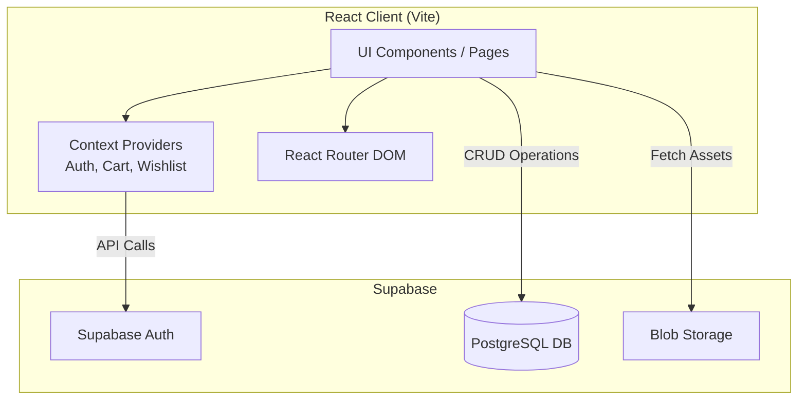
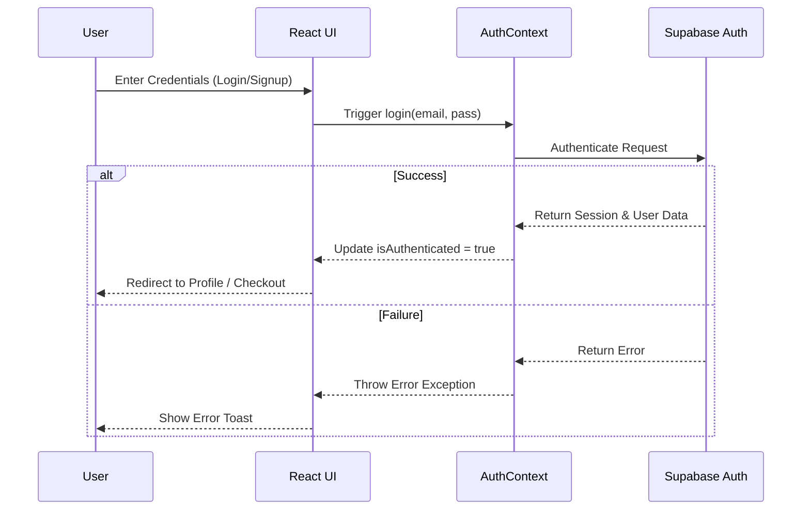
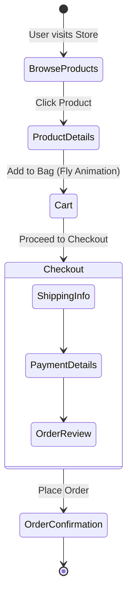
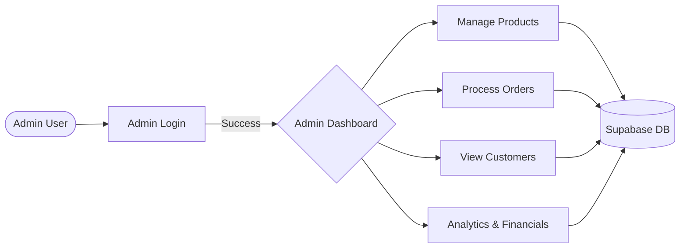

# Jog & Joy - Premium E-commerce Platform

<p align="center">
  <em>A modern, high-fidelity e-commerce storefront and admin dashboard built with React, Vite, and TailwindCSS.</em>
</p>

---

## 📖 Overview

Welcome to the **Jog & Joy** repository. This project serves as a comprehensive, production-ready e-commerce platform designed to offer a premium, highly interactive user experience. It features separate, dedicated workflows for standard customers (storefront) and store administrators (admin dashboard). 

Jog & Joy specializes in categorizing products across departments (Men, Women, Kids) while providing an intuitive, aesthetically pleasing, and highly performant shopping journey.

---

## ✨ Key Features

### 🛍️ Storefront (Customer Facing)
- **Vibrant Department Pages**: Bespoke landing pages for Men, Women, Kids, and New Arrivals with distinct aesthetic themes.
- **Interactive Wishlist & Cart**: Full-page cart UI with dynamic subtotal calculations, coupled with micro-animations on wishlist interactions.
- **Advanced Filtering & Pagination**: Inline expandable filtering systems and strict 16-item pagination with auto-scroll features.
- **Premium Animations**: Web Animations API (WAAPI) integration for "Fly-to-Cart" effects and smooth transitions.
- **Distributor Network Portal**: B2B partnership capabilities via a dedicated portal.

### 🛡️ Admin Dashboard (Management Facing)
- **Comprehensive Management**: Isolated admin routes for managing Products, Categories, Orders, Customers, and Inventory.
- **Analytics & Financials**: Dedicated views to track store performance, promotions, and financial health.
- **Live Support**: Admin messages and customer review management interfaces.

---

## 🛠️ Tech Stack

- **Frontend Framework**: React 18
- **Build Tool**: Vite
- **Styling**: Tailwind CSS & Radix UI
- **Routing**: React Router DOM v6
- **State Management**: React Context API (`AuthContext`, `CartContext`, `WishlistContext`)
- **Backend & Database**: Supabase (`@supabase/supabase-js`)
- **Animations**: Framer Motion, GSAP, Web Animations API (WAAPI)
- **Icons**: Lucide React & React Icons

---

## 🏗️ System Architecture

The project follows a standard decoupled React architecture where the frontend communicates securely with a Supabase backend.



---

## 📂 Directory Structure

```text
src/
├── api/            # API interaction logic and mock data fallbacks
├── assets/         # Static assets, images, and global styles
├── components/     # Reusable React components
│   ├── admin/      # Admin dashboard specific components
│   ├── home/       # Storefront homepage sections
│   ├── layout/     # Navbars, Footers, sidebars, and wrappers
│   ├── smoothui/   # Complex/animated UI components
│   └── ui/         # Base UI elements (buttons, modals, drawers)
├── context/        # React Context providers (Auth, Cart, Wishlist, etc.)
├── data/           # Static JSON datasets (categories, generic info)
├── lib/            # Library configurations (Supabase client setup)
├── pages/          # High-level route components (Pages)
│   └── admin/      # Admin-specific route pages
├── queries/        # React Query hooks / data fetching logic
├── types/          # Type definitions and interfaces
└── utils/          # Helper functions and formatters
```

---

## 🔄 Core Workflows

### 1. User Authentication Workflow


### 2. E-commerce Checkout Workflow


### 3. Admin Operations Workflow


---

## 🚀 Getting Started

Follow these steps to set up the project locally for development.

### Prerequisites
- **Node.js**: v18.0.0 or higher
- **npm** or **yarn**

### Installation

1. **Clone the repository**
   ```bash
   git clone https://github.com/your-username/JOG-AND-JOY.git
   cd JOG-AND-JOY
   ```

2. **Install dependencies**
   ```bash
   npm install
   ```

3. **Environment Variables**
   Create a `.env.local` file in the root directory and add your Supabase credentials and any other required keys:
   ```env
   VITE_SUPABASE_URL=your_supabase_project_url
   VITE_SUPABASE_ANON_KEY=your_supabase_anon_key
   # Add other variables like Cloudinary or EmailJS keys if applicable
   ```

4. **Run the development server**
   ```bash
   npm run dev
   ```
   The application will be available at `http://localhost:5173`.

### Building for Production

To create an optimized production build:
```bash
npm run build
```
You can preview the built application locally using:
```bash
npm run preview
```

---

## 📜 Deployment

This project is configured for seamless deployment on **Vercel** (as indicated by the `vercel.json` configuration). Pushing to the `main` branch will automatically trigger a production build. Ensure all environment variables are properly configured in your Vercel project dashboard.

---

## 🕒 Recent History / Changelog

- **Vibrant Theme Standardization**: Overhauled Category pages replacing minimalist styles with vibrant aesthetics (Misty Rose pastel overlays, bright highlights).
- **Interactive Wishlist**: Added "popping" scale micro-animations and "Clear All" functionality.
- **Global Pagination**: Enforced 16-item limits with smooth auto-scroll to the top of the grid.
- **Inline Expandable Filtering**: Seamless inline UI panes for category and age-group sorting.
- **Dedicated Cart Page**: Upgraded from a drawer to a full page with tabular item layouts and dynamic summaries.
